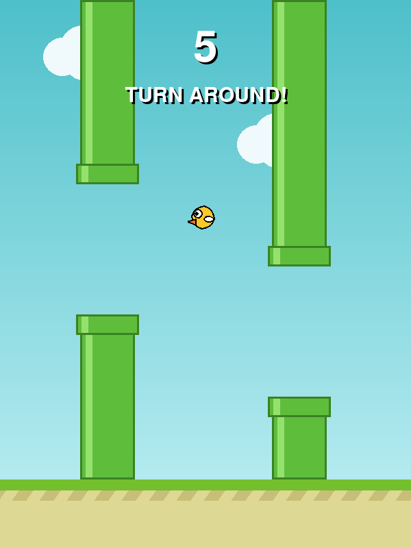
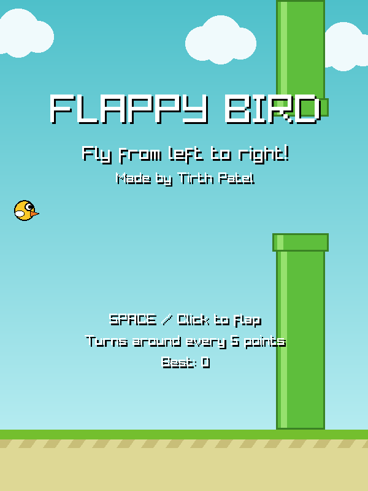

# 🐦 Flappy Bird – Left to Right (and back!)


A twist on the classic Flappy Bird, built twice: once in **Python** with **pygame** and once in **C++** with **raylib**.
The bird starts on the **left** and flies **right**, and every **5 points** it **turns around** and flies back through the pipes.

No image files needed: the bird, pipes, clouds and ground are all drawn with code.

| Python (pygame) | C++ (raylib) |
|:---:|:---:|
|  |  |

---

## 🎮 Gameplay

1. The bird waits on the left side of the screen. Press **Space** to start.
2. Flap through the gaps between the pipes. Each pipe you pass is **+1 point**.
3. At **5, 10, 15, ...** points, the bird **turns around** and you fly back through the pipes you just passed.
4. Hit a pipe or the ground and it's game over. Beat your **high score**!

## ⌨️ Controls

| Key | Action |
|-----|--------|
| `SPACE` / `↑` / Left click | Flap, start, and restart |
| `P` | Pause / resume |
| `ESC` | Quit |

---

## 🚀 Play it

### Option 1: Windows, no install (C++ version)

Download **`FlappyBird.exe`** from the [Releases](https://github.com/pateltirth128/flappy-bird/releases) page and double-click it.
If Windows shows *"Windows protected your PC"*, click **More info → Run anyway**.

### Option 2: Python version

**Requirements:** Python 3.8+ and pygame

```bash
git clone https://github.com/pateltirth128/flappy-bird.git
cd flappy-bird/python
pip install -r requirements.txt
python flappybird.py
```

> **Windows tip:** if `python` opens the Microsoft Store or says *"Python was not found"*, search Windows for **Manage app execution aliases**, turn off **python.exe** and **python3.exe**, then restart your terminal.

### Option 3: Build the C++ version

**Windows (easiest):** install [raylib for Windows](https://raysan5.itch.io/raylib) (it puts raylib and a C++ compiler in `C:\raylib`), then double-click **`cpp/build.bat`**. It builds `FlappyBird.exe` and starts the game.

**Any OS with CMake** (Visual Studio, CLion, VS Code, Linux, macOS). CMake downloads raylib for you:

```bash
cd cpp
cmake -S . -B build
cmake --build build --config Release
```

---

## 🧠 How it works

Both versions use the same game loop:

```
input  →  update()  →  draw()
keys      physics      graphics
```

- **Input** reads the keyboard and mouse.
- **`update()`** applies gravity, moves the pipes, checks collisions, and counts points.
- **`draw()`** draws the sky, clouds, pipes, ground, bird, and text.

**Changing direction:** one variable stores the direction (`1` = right, `-1` = left). Pipes move by `-direction * SPEED` every frame, so flipping it makes the whole world scroll the other way, and the bird is drawn mirrored to face the new direction.

**Turning around safely:** "TURN AROUND!" appears as soon as you hit 5, 10, 15, … points, but the bird waits until it's in the open space between pipes before it flips. If it turned while still inside the pipe it just passed, it would get stuck there and crash.

### What's different in C++

- **Split into classes and files.** `main.cpp` is only 3 lines; `Bird`, `Pipe` and `Game` each live in their own `.h` (what the class has) and `.cpp` (how it works) file.
- **Fixed timestep.** The game logic runs exactly 60 times a second, separate from drawing, with VSync on, so it plays at the same speed and stays smooth on any monitor.
- **One standalone `.exe`.** No Python or libraries needed to play.

---

## 🔧 Customize it

Change these values at the top of `python/flappybird.py` or in `cpp/src/Config.h` (rebuild after changing C++):

| Setting | Default | Effect |
|---------|---------|--------|
| `SPEED` | `3.2` | How fast the bird flies |
| `TURN_EVERY` | `5` | Points before the bird turns around |
| `GRAVITY` | `0.45` | How fast the bird falls |
| `FLAP` | `-8.5` | How strong each flap is |
| `GAP` | `190` | Gap between pipes (smaller = harder) |
| `SPACING` | `280` | Distance between pipes |
| `AUTHOR` | `"Tirth Patel"` | Name shown in the game |

## 📁 Project structure

```
flappy-bird/
├── python/
│   ├── flappybird.py      # the whole game in one file
│   └── requirements.txt   # pygame
├── cpp/
│   ├── src/
│   │   ├── main.cpp       # creates the Game and runs it
│   │   ├── Config.h       # every setting in one place
│   │   ├── Bird.h/.cpp    # flap, gravity, hitbox, drawing
│   │   ├── Pipe.h/.cpp    # gap position, collision, drawing
│   │   └── Game.h/.cpp    # main loop, input, scoring, turning around
│   ├── CMakeLists.txt     # CMake build (downloads raylib)
│   └── build.bat          # one-click Windows build
├── screenshots/
├── README.md
├── LICENSE
└── .gitignore
```

## 👤 Author

**Tirth Patel**, Computer Science student at the University of Regina

- GitHub: [@pateltirth128](https://github.com/pateltirth128)
- LinkedIn: [tirth1228](https://www.linkedin.com/in/tirth1228)

## 📄 License

Released under the [MIT License](LICENSE). Feel free to use and modify it, but please keep the credit.
